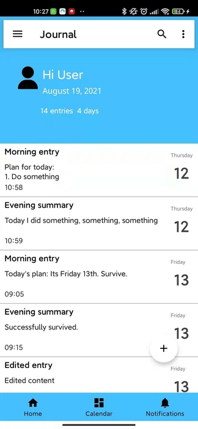

# Journal App
 A simple Journaling app for Android written in Java

### Screenshots

Single-activity structure with MVVM architecture.

### Libraries used
1. Navigation component
2. Fragment
3. Bottom-navigation
4. Navigation Drawer
5. ViewModel
6. LiveData
7. Room

